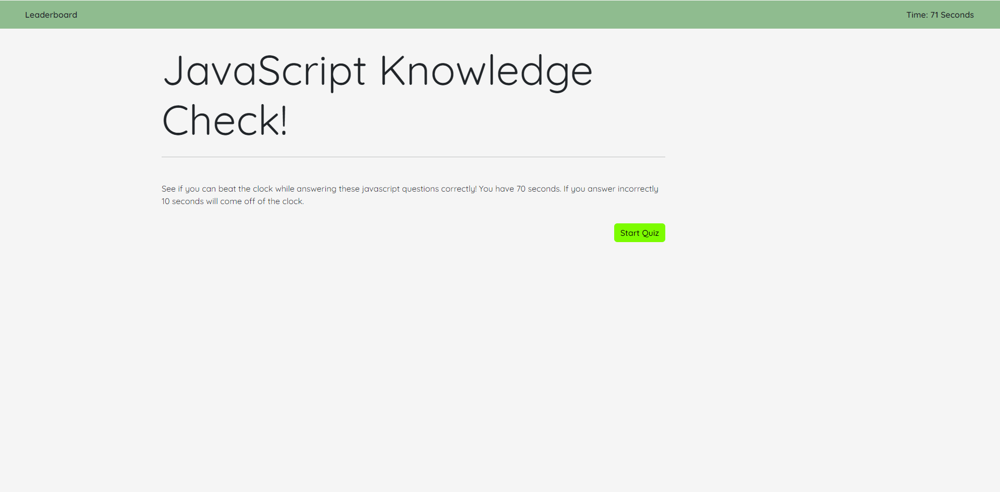

# JavaScript Quiz

## Description

- To build a quiz capible of determining the users knowlege of JavaScript.
- I built this quiz to further understand the functionality of JavaScript.
- This quiz allows the user to experince my knowledge of JavaScript first hand.
- This exercise taught me about JavaScript fundamentals.

## Usage

Website URL: https://lindstdb.github.io/code-quiz/

## Screenshot

## Credits
https://www.interviewbit.com/javascript-mcq/
https://coding-boot-camp.github.io/full-stack/github/professional-readme-guide

